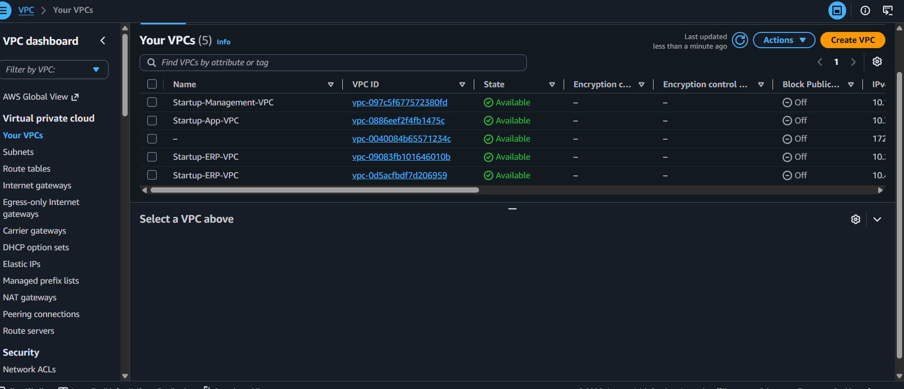
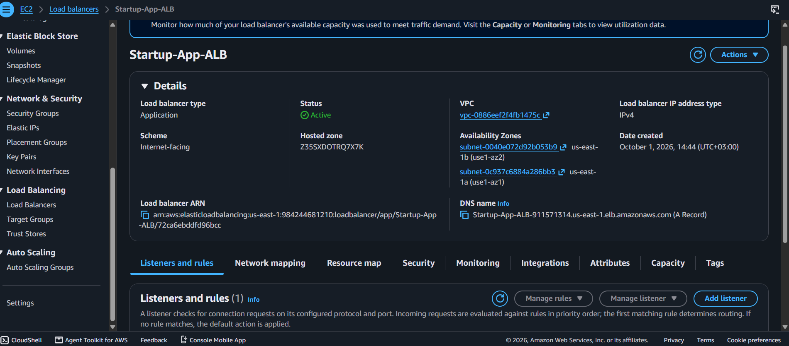
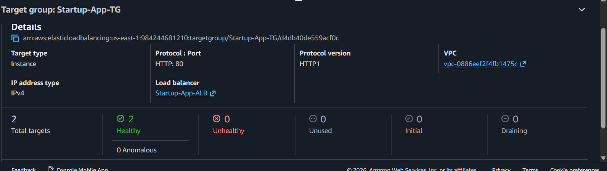
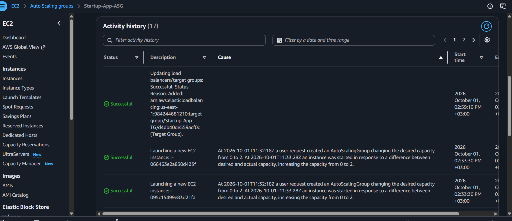
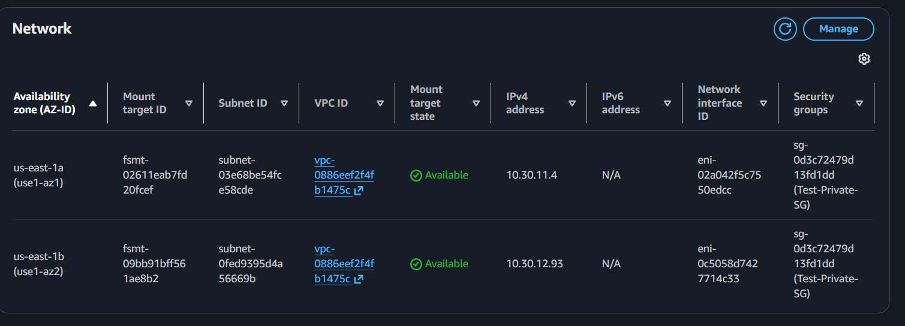
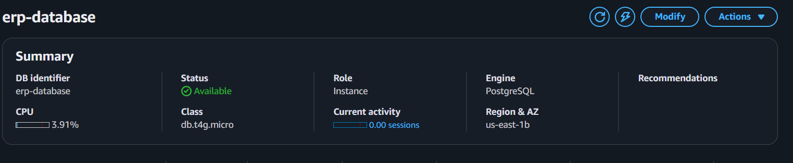
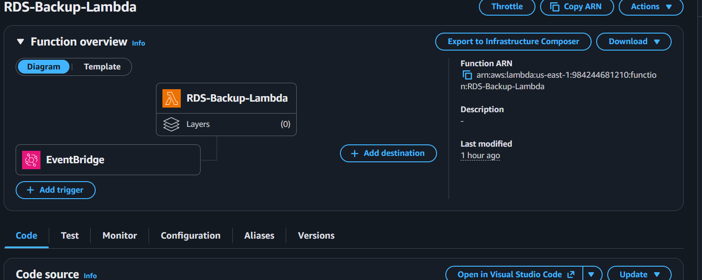
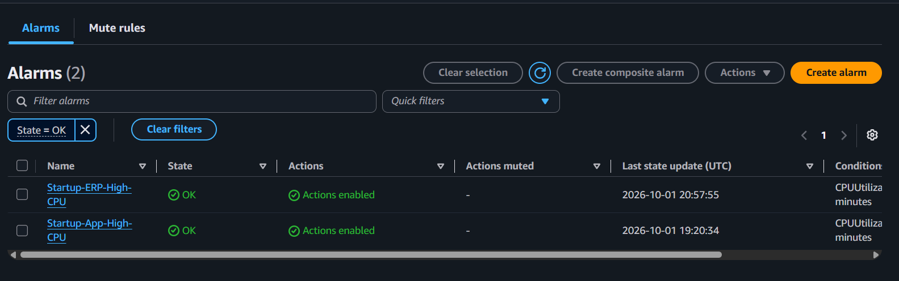
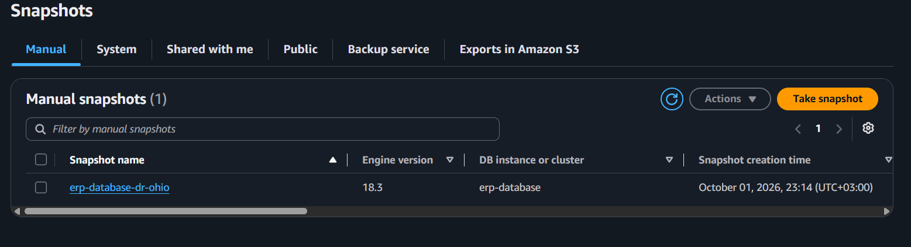

# 🚀 Startup Company — AWS Cloud & DevOps Infrastructure

## 📌 Project Overview

This project implements a production-style AWS Cloud & DevOps infrastructure for a startup company.

The infrastructure is designed to provide:

* High Availability
* Multi-AZ architecture
* Network segmentation
* Secure administrative access
* Private database connectivity
* Auto Scaling and self-healing
* Shared storage
* Monitoring and alerting
* Automated database backups
* Disaster Recovery
* Centralized management access

---

# 🏗️ Architecture

```text
                              INTERNET
                                  |
                                  v
                         +----------------+
                         | Application    |
                         | Load Balancer  |
                         +-------+--------+
                                 |
                    +------------+------------+
                    |                         |
                    v                         v
             App Server AZ-1            App Server AZ-2
             Private Subnet             Private Subnet
             10.30.11.0/24              10.30.12.0/24
                    |                         |
                    +------------+------------+
                                 |
                              Amazon EFS
                           Shared Documents
                                 |
                    +------------+------------+
                    |   Startup-App-VPC       |
                    |      10.30.0.0/16       |
                    +------------+------------+
                                 |
                         VPC Peering
                         /           \
                        /             \
                       v               v
          +-------------------+   +-------------------+
          | Management VPC    |   | ERP VPC           |
          | 10.10.0.0/16     |   | 10.20.0.0/16      |
          |                   |   |                   |
          | Central Bastion   |   | ERP Server        |
          |                   |   |       |           |
          +-------------------+   |       v           |
                                  | PostgreSQL RDS     |
                                  +-------------------+

       Monitoring:
       CloudWatch → SNS

       Automated Backup:
       EventBridge → Lambda → RDS Snapshot

       Disaster Recovery:
       RDS Snapshot → Cross-Region Copy
```

---

# 🌐 Network Architecture

The infrastructure is divided into three separate VPCs to provide network segmentation and centralized management.

## 1️⃣ Management VPC

**Name:** `Startup-Management-VPC`

**CIDR:**

```text
10.10.0.0/16
```

### Subnets

* `Management-Public-AZ1`
* `Management-Public-AZ2`
* `Management-Private-AZ1`
* `Management-Private-AZ2`

### Main Resource

* Central Bastion Host

---

## 2️⃣ ERP VPC

**Name:** `Startup-ERP-VPC`

**CIDR:**

```text
10.20.0.0/16
```

### Public Subnets

```text
Dev-Public-AZ1 → 10.20.1.0/24
Dev-Public-AZ2 → 10.20.2.0/24
```

### Private Subnets

```text
Dev-Private-AZ1 → 10.20.11.0/24
Dev-Private-AZ2 → 10.20.12.0/24
```

### Main Resources

* ERP Server
* Amazon RDS PostgreSQL
* NAT Gateway

---

## 3️⃣ Application VPC

**Name:** `Startup-App-VPC`

**CIDR:**

```text
10.30.0.0/16
```

### Public Subnets

```text
Test-Public-AZ1 → 10.30.1.0/24
Test-Public-AZ2 → 10.30.2.0/24
```

### Private Subnets

```text
Test-Private-AZ1 → 10.30.11.0/24
Test-Private-AZ2 → 10.30.12.0/24
```

### Main Resources

* Application Load Balancer
* Auto Scaling Group
* Private Application Servers
* Amazon EFS
* NAT Gateway

---

# 🔗 VPC Peering

Two VPC Peering connections were configured.

### Management ↔ ERP

```text
Admin-to-Dev-Peering
```

### Management ↔ Application

```text
Admin-to-Test-Peering
```

There is intentionally **no direct VPC Peering between the ERP VPC and Application VPC**.

This keeps the Management VPC as the centralized administrative network.

### Management Private Route Table

```text
10.20.0.0/16 → Admin-to-Dev-Peering
10.30.0.0/16 → Admin-to-Test-Peering
```

### Application Private Route Table

```text
10.10.0.0/16 → Admin-to-Test-Peering
```

Connectivity between the Management VPC and private application resources was validated using SSH/TCP connectivity tests.

---

# 🔐 Central Bastion Host

## Startup-Central-Bastion

The Bastion Host provides a controlled administrative entry point to private resources.

```text
Instance Type: t3.micro
Operating System: Ubuntu
Private IP: 10.10.0.88
Public IP: 3.221.158.87
```

### Access Flow

```text
Administrator
      |
      | SSH :22
      v
Central Bastion
      |
      | SSH :22
      v
Private Servers
```

The Bastion Security Group restricts SSH access to the administrator's IP address.

---

# 👥 IAM Team Structure

Three IAM teams were created to separate access levels.

```text
Startup-Admin-Team
Startup-Dev-Team
Startup-Test-Team
```

Users:

```text
startup-admin
startup-dev
startup-test
```

## Admin Team

Administrative access to infrastructure services including:

* EC2
* VPC
* Elastic Load Balancing
* Auto Scaling
* CloudWatch

## Development Team

EC2 operational permissions including:

* Describe
* Run
* Start
* Stop
* Reboot
* Terminate
* Create Tags

## Testing Team

Read-only EC2 access:

```text
ec2:Describe*
```

> **Note:** The current IAM policies use `Resource: "*"`. Therefore, the project demonstrates team-level permission separation, but does not implement strict resource-level isolation between individual VPCs.

---

# 🖥️ ERP Server

The ERP workload is deployed inside the private ERP VPC.

The ERP server communicates with the private PostgreSQL database using:

```text
TCP 5432
```

### Connection Flow

```text
ERP Server
     |
     | PostgreSQL :5432
     v
Private RDS PostgreSQL
```

The database is not publicly accessible.

---

# 🗄️ Amazon RDS PostgreSQL

## Database Configuration

```text
Identifier: erp-database
Engine: PostgreSQL
Instance Class: db.t4g.micro
Region: us-east-1
Availability Zone: us-east-1b
Public Access: No
Storage: 20 GiB
```

The database is deployed privately and is accessed only through the internal network.

---

# ⚖️ Application Load Balancer

## Startup-App-ALB

Configuration:

```text
Type: Internet-facing
IP Type: IPv4
Listener: HTTP :80
VPC: Startup-App-VPC
```

The ALB is deployed across two Availability Zones.

### Traffic Flow

```text
Internet
   |
   v
Application Load Balancer
   |
   | HTTP :80
   v
Private Application Servers
```

---

# 🎯 Target Group

## Startup-App-TG

Configuration:

```text
Target Type: Instance
Protocol: HTTP
Port: 80
Health Check Path: /
```

The Target Group is connected to the Application Load Balancer.

Only healthy application instances receive traffic.

---

# 📈 Auto Scaling Group

## Startup-App-ASG

Configuration:

```text
Desired Capacity: 2
Minimum Capacity: 2
Maximum Capacity: 3
```

The application servers are distributed across two Availability Zones:

```text
us-east-1a
us-east-1b
```

Private subnets:

```text
Test-Private-AZ1
Test-Private-AZ2
```

This provides Multi-AZ application availability and automatic instance replacement.

---

# 💾 Amazon EFS

## Startup-App-EFS

```text
File System ID:
fs-0d994fec1b518cb9a
```

Amazon EFS provides shared storage between application servers.

### Mount Targets

#### Availability Zone 1

```text
Private IP: 10.30.11.4
Subnet: Test-Private-AZ1
```

#### Availability Zone 2

```text
Private IP: 10.30.12.93
Subnet: Test-Private-AZ2
```

### NFS Configuration

```text
Protocol: NFS
Version: NFSv4.1
Port: TCP 2049
```

### Shared Storage Test

A test file created on one application server was successfully accessed from another application server.

This validated that multiple application servers can use the same shared EFS filesystem.

### Persistent Mount

EFS was configured through:

```text
/etc/fstab
```

The mount was successfully validated after reboot.

---

# 🔒 Security Group Architecture

Security Groups were configured to restrict communication between infrastructure components.

## ALB → Application

```text
ALB Security Group
        |
        | HTTP :80
        v
Application Security Group
```

Application servers allow HTTP traffic only from the ALB Security Group.

---

## Bastion → Private Servers

```text
Central Bastion
      |
      | SSH :22
      v
Private Servers
```

---

## Application → EFS

```text
Application Servers
       |
       | NFS :2049
       v
Amazon EFS
```

---

## ERP → RDS

```text
ERP Server
    |
    | PostgreSQL :5432
    v
Amazon RDS
```

---

# 📊 CloudWatch Monitoring

## Application Monitoring

CloudWatch alarm:

```text
Startup-App-High-CPU
```

Configuration:

```text
Namespace: AWS/EC2
Metric: CPUUtilization
Dimension: AutoScalingGroupName
Statistic: Average
Period: 5 minutes
Threshold: > 70%
Datapoints: 2 of 2
```

When the alarm enters the ALARM state, an SNS notification is triggered.

---

# 🗄️ RDS Monitoring

CloudWatch alarm:

```text
Startup-ERP-High-CPU
```

Configuration:

```text
Namespace: AWS/RDS
Metric: CPUUtilization
Database: erp-database
Statistic: Average
Period: 5 minutes
Threshold: > 70%
```

The alarm is configured to send notifications through SNS.

---

# 🔔 Amazon SNS

SNS topic:

```text
backup-notifications
```

SNS is used for infrastructure notifications including CloudWatch alarms.

---

# 🤖 Automated RDS Backup

## AWS Lambda

Function:

```text
RDS-Backup-Lambda
```

Runtime:

```text
Node.js 24.x
```

The Lambda function automatically creates RDS snapshots for:

```text
erp-database
```

### Snapshot Naming Convention

```text
erp-database-auto-YYYYMMDD...
```

### Backup Logic

```text
EventBridge
     |
     | Daily
     v
RDS-Backup-Lambda
     |
     v
Create RDS Snapshot
     |
     v
Find Automated Snapshots
     |
     v
Sort by Creation Time
     |
     v
Keep Latest 3
     |
     v
Delete Older Automated Snapshots
```

The Lambda function was successfully tested and created RDS snapshots.

Example snapshots:

```text
erp-database-auto-20261001t203128
erp-database-auto-20261001t203529
erp-database-auto-20261001t204408
```

> **Important:** The Lambda function creates RDS snapshots. It does not export RDS snapshots directly to Amazon S3.

---

# ⏰ EventBridge Automation

Rule:

```text
RDS-Daily-Backup
```

Configuration:

```text
Type: Scheduled
Frequency: Every 1 day
Status: Enabled
Target: RDS-Backup-Lambda
```

### Automation Flow

```text
Amazon EventBridge
        |
        | Every 1 day
        v
RDS-Backup-Lambda
        |
        v
Create RDS Snapshot
        |
        v
Keep Latest 3 Snapshots
        |
        v
Delete Older Automated Snapshots
```

---

# 🌍 Disaster Recovery

## RDS Automated Backups

Automated backups are enabled for the RDS database.

Current retention:

```text
1 day
```

The AWS Free Tier account limitation prevented increasing the retention period to 7 days without upgrading the account.

---

## Manual DR Snapshot

```text
erp-database-dr-snapshot
```

Status:

```text
Available
```

---

## Cross-Region DR Snapshot

The DR snapshot was copied to another AWS region:

```text
Region: us-east-2
```

Snapshot:

```text
erp-database-dr-ohio
```

Status:

```text
Available
```

A running RDS database was not created in the DR region to avoid unnecessary ongoing infrastructure costs.

---

# 🚀 High Availability / Self-Healing Test

A real application failover test was performed to validate the Auto Scaling and Load Balancer architecture.

## Initial State

The Application Target Group contained:

```text
2 Total Targets
2 Healthy
0 Unhealthy
```

---

## Failure Simulation

One application instance was intentionally terminated:

```text
i-05d03d4f4894651b0
```

---

## Auto Scaling Response

The Auto Scaling Group detected the terminated instance.

Activity History showed the instance being terminated because of the EC2 health state.

The Auto Scaling Group automatically launched a replacement instance:

```text
i-00a8d5738b7ea3061
```

---

## Recovery

The replacement instance registered with the Target Group.

Final Target Group state:

```text
2 Total Targets
2 Healthy
0 Unhealthy
```

The replacement instance successfully passed the ALB health check.

The application continued to be served through the Application Load Balancer.

---

# 🔄 HA Self-Healing Flow

```text
Application Instance Failure
          |
          v
EC2 Health Check
          |
          v
Auto Scaling Detects Failure
          |
          v
Launch Replacement Instance
          |
          v
Application Registers with Target Group
          |
          v
ALB Health Check
          |
          v
Target Becomes Healthy
          |
          v
Application Continues Serving Traffic
```

This test validated:

* Multi-AZ architecture
* Application Load Balancer
* Target Group health checks
* Auto Scaling
* Self-healing
* Application High Availability

---

# 🛠️ Troubleshooting Case — ALB 504 Error

During implementation, the ALB initially returned:

```text
504 Gateway Time-out
```

The Target Group reported:

```text
2 Unhealthy Targets
Request timed out
```

## Investigation

### Nginx

Nginx was verified to be running:

```text
active (running)
```

### Local HTTP Test

```bash
curl -I http://localhost
```

Result:

```text
HTTP/1.1 200 OK
```

### Listening Port

Nginx was listening on:

```text
0.0.0.0:80
```

### UFW

Ubuntu firewall was inactive:

```text
Status: inactive
```

### Network Routing

VPC routing tables and VPC Peering routes were verified.

### Security Group Investigation

The application Security Group initially allowed HTTP traffic from the wrong Security Group.

The actual ALB Security Group was identified:

```text
sg-0ce68ae9d57bbed03
```

HTTP port 80 was then allowed from the ALB Security Group to the Application Security Group:

```text
sg-02ec4978e4b8997e8
```

### Result

The Target Group changed to:

```text
Healthy
```

The Application Load Balancer successfully served the application.

---

# 🧪 Connectivity Validation

## Bastion → Application

TCP connectivity was tested using:

```bash
nc -vz -w 5 <private-ip> 80
```

---

## Application → Bastion

SSH connectivity through VPC Peering was validated:

```bash
nc -vz -w 5 10.10.0.88 22
```

Result:

```text
Connection succeeded
```

---

## Application → EFS

NFS connectivity was validated:

```bash
nc -vz -w 5 10.30.11.4 2049
```

Result:

```text
Connection succeeded
```

EFS was successfully mounted using NFSv4.1.

---

# 🧰 Technologies Used

## AWS

* Amazon VPC
* Amazon EC2
* Application Load Balancer
* Auto Scaling
* IAM
* Security Groups
* VPC Peering
* Amazon RDS
* PostgreSQL
* Amazon EFS
* Amazon CloudWatch
* Amazon SNS
* AWS Lambda
* Amazon EventBridge
* Amazon S3

## Linux / DevOps

* Ubuntu
* Nginx
* SSH
* NFS
* systemd
* `/etc/fstab`
* TCP troubleshooting
* High Availability
* Disaster Recovery
* Infrastructure troubleshooting

---
## 📸 Project Screenshots

### 1. 🏗️ VPC Architecture

Shows the three-VPC architecture used for Management, ERP, and Application workloads.



### 2. ⚖️ Application Load Balancer

Internet-facing Application Load Balancer distributing traffic across the application tier.



### 3. 🎯 Target Group — High Availability

Target Group showing both application servers registered and healthy.



### 4. 🔄 Auto Scaling — Self-Healing

Auto Scaling Group automatically launched a replacement instance after an application instance was terminated.



### 5. 💾 EFS — Shared Storage

Amazon EFS provides shared storage between application servers across Availability Zones.



### 6. 🗄️ Private RDS PostgreSQL

Private PostgreSQL database deployed without public internet access.



### 7. 🤖 Automated RDS Backup — Lambda + EventBridge

AWS Lambda creates automated RDS snapshots, triggered by an EventBridge scheduled rule.



### 8. 📊 CloudWatch Monitoring

CloudWatch alarms monitor CPU utilization for both the application and ERP database tiers.



### 9. 💾 RDS Backup Snapshots

Automated RDS snapshots are created and retained for recovery.


### 10. 🌎 Cross-Region Disaster Recovery

RDS snapshot copied to the secondary AWS Region for disaster recovery.



---

# 📋 Project Status

| Component                 | Status                   |
| ------------------------- | ------------------------ |
| Management VPC            | ✅ Completed              |
| ERP VPC                   | ✅ Completed              |
| Application VPC           | ✅ Completed              |
| Public / Private Subnets  | ✅ Completed              |
| Central Bastion           | ✅ Completed              |
| VPC Peering               | ✅ Completed              |
| IAM Teams                 | ✅ Completed              |
| ERP Server                | ✅ Completed              |
| Private PostgreSQL RDS    | ✅ Completed              |
| Application Load Balancer | ✅ Completed              |
| Auto Scaling Group        | ✅ Completed              |
| Multi-AZ Application      | ✅ Completed              |
| EFS Shared Storage        | ✅ Completed              |
| EFS Auto-Mount            | ✅ Validated              |
| CloudWatch EC2 Alarm      | ✅ Completed              |
| CloudWatch RDS Alarm      | ✅ Completed              |
| SNS Notifications         | ✅ Configured             |
| Lambda RDS Backup         | ✅ Tested                 |
| EventBridge Daily Backup  | ✅ Enabled                |
| Snapshot Cleanup          | ✅ Implemented            |
| Cross-Region DR Snapshot  | ✅ Completed              |
| HA Failover Test          | ✅ Successfully Validated |

---

# 🎯 Key Skills Demonstrated

* AWS Cloud Architecture
* VPC Design
* Network Segmentation
* VPC Peering
* IAM
* EC2
* Application Load Balancer
* Auto Scaling
* Multi-AZ Architecture
* Security Groups
* RDS PostgreSQL
* EFS
* CloudWatch
* SNS
* Lambda
* EventBridge
* Automated Backups
* Disaster Recovery
* Linux Administration
* Nginx
* NFS
* Network Troubleshooting
* High Availability
* Self-Healing Infrastructure

---

# 💼 Portfolio Description

## AWS Cloud Infrastructure & DevOps Project

Designed and implemented a multi-VPC AWS infrastructure for a startup environment, including centralized Bastion access, public/private subnet architecture, VPC Peering, private PostgreSQL RDS, an internet-facing Application Load Balancer, Multi-AZ Auto Scaling, EFS shared storage, CloudWatch/SNS monitoring, automated RDS snapshot management using Lambda and EventBridge, and cross-region disaster recovery.

Validated High Availability by intentionally terminating an application instance and demonstrating automatic Auto Scaling replacement followed by successful ALB health-check recovery.

---

# 📚 Project Highlights

### Network

```text
3 VPCs
6+ Private/Public subnet groups
2 VPC Peering connections
Central Bastion architecture
```

### Compute

```text
EC2
Auto Scaling
Application Load Balancer
Nginx
```

### Database

```text
Private RDS PostgreSQL
Automated Snapshots
Cross-Region DR Snapshot
```

### Storage

```text
Amazon EFS
NFSv4.1
Multi-AZ Shared Storage
Persistent Mount
```

### Automation

```text
AWS Lambda
Amazon EventBridge
Automated RDS Backups
Snapshot Retention Cleanup
```

### Monitoring

```text
CloudWatch
SNS
EC2 CPU Monitoring
RDS CPU Monitoring
```

---

# 💰 Cost Control

This project was implemented with AWS Free Tier / available AWS credits where possible.

After completing the lab, review and remove resources that may generate ongoing charges.

Important resources to review:

* NAT Gateways
* RDS
* EFS
* Application Load Balancer
* EC2 instances
* Elastic IPs
* Cross-region snapshots
* CloudWatch/SNS usage

Before deleting resources, preserve screenshots proving:

* ALB targets are Healthy
* Auto Scaling replacement
* CloudWatch alarms
* Lambda execution
* RDS snapshots
* Cross-region DR snapshot
* EFS shared storage
* VPC architecture
* IAM team permissions

---

# 👨‍💻 Author

**AbdullaH9660**

Communication & Computer Engineering Student

**Cloud & DevOps Engineering**

AWS | Linux | Docker | Kubernetes | Terraform | CI/CD
 
